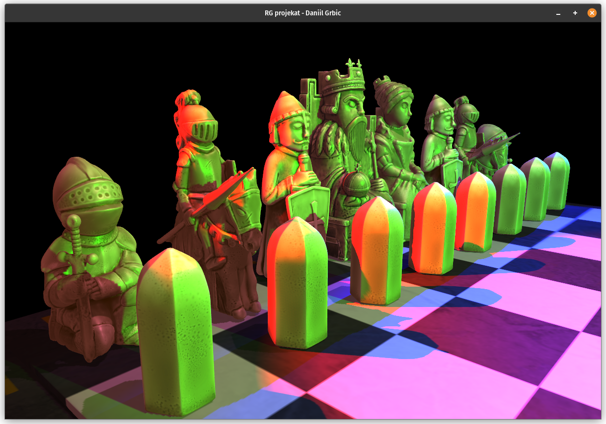

# RG-projekat
Project made for the Computer graphics course at the [Mathematical faculty](http://www.matf.bg.ac.rs/) (University of Belgrade)

  
  

### Build instructions (Debian-based Linux)
- Install required packages: `sudo apt-get install g++ cmake git build-essential libgl1-mesa-dev libsoil-dev libglm-dev libassimp-dev libglew-dev libglfw3-dev libxinerama-dev libxcursor-dev libxi-dev mesa-common-dev mesa-utils libxxf86vm-dev libfreetype6-dev` 
- Clone this project and navigate to its folder:
  - `git clone https://github.com/daniilgrbic/RG-projekat.git`
  - `cd RG-projekat/`
- Run cmake, then build:
  - `cmake -B ./build`
  - `make --dircetory=build`
- Run the executable:
  - `./RG-projekat`

### Controls
- **WASD** to move camera around
- **LSHIFT** to lower the camera, **SPACE** to go up
- **H** to toggle light indicators
- **F** to show FPS
- **RIGHT CLICK** to (un)focus window

### Implemented lessons
- Group A: **anti-aliasing**, **cubemaps**
- Group B: **soft point shadows (multiple light sources)**

### Credits
- [LearnOpenGL](https://github.com/JoeyDeVries/LearnOpenGL) by
    [JoeyDeVries](https://github.com/JoeyDeVries/)
- [project_base](https://github.com/matf-racunarska-grafika/project_base/) by
    [spaske00](https://github.com/spaske00)
- Chess pieces and board uploaded by user 
    [printable_models](https://free3d.com/user/printable_models) at 
    [free3d.com](https://free3d.com/).
